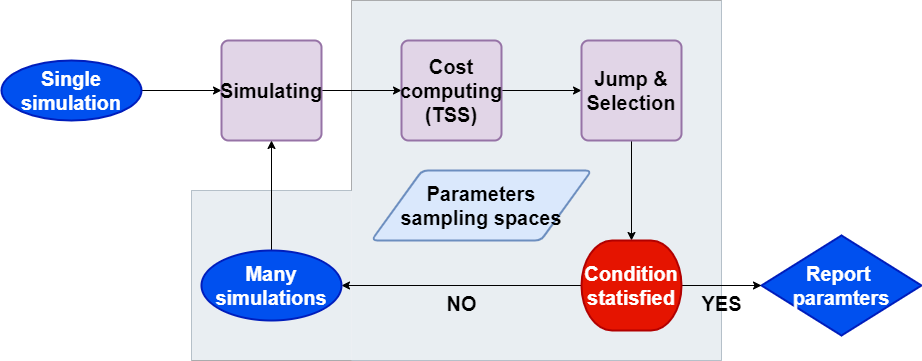

# Methods


## Conventional 


The conventional approach of parameterisation for APSIMX models is a trial and error approach with three steps:  
1) the derivation of parameters from observed (measured) data via linear regressions  
2) the manual modification of parameters in sub-models via the APSIMX user interface or the base scripts in computer languages and   
3) the evaluation of the modified model performance manually

This approach is time-consuming and can be problematic when newly observed data
are introduced to improve the comprehensibility of the model, especially if
these data come from different sources. The manual process of model calibration
could result in poor model performance and potentially increase the models'
uncertainty. In contrast, agricultural models are expected to be validated by as
much data as possible from different environments to simulate a wide range of
scenarios


## Alternative

Automation could aim the development process. 

Figure \@ref(fig:figDEflow) 

```{r figDEflow, fig.pos='centre', fig.cap="Optimisation workflow simplified.", out.width='80%'}

```

